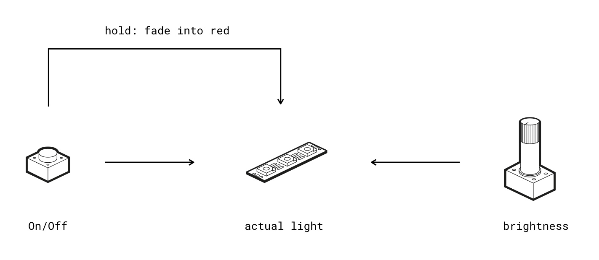

## Install the blokdots MVP - Software

1. Download and install [Node](https://nodejs.org/)
2. Download the repository
3. Open repository in terminal
4. Type ```npm install```

## Use the blokdots MVP - Software

### First Use

The hardware is connected via bluetooth (I know, I know, unnecessary, but when I started to build the prototype there has been more intended). The brain is called "**SNES**" as bluetooth device.

### Start Demo

1. Make sure the brain is powered and connected via bluetooth
2. Open the repository folder in terminal and type ```npm start```
3. Once started the brain should automatically connect to the software (success is displayed when all LEDs flash yellow once)    
If the hardware does not connect the *Live View* window will automatically reload again to try to reconnect.

### Demo Run
  
The intended demo is like this:  
#### *"We want to prototype a desk lamp, which can be adjusted to the light temperature of the room, similar to the "night-shift mode" or "True Tone display" on a Mac / iPhone."*



1. Display live values of pins (1 -> Button, 5 -> Potentiometer)
6. By hitting the "open project" button in the upper right (document with arrow) a new window pops up, showing the IFTTT programming
7. One component is needed for the project but not set up -> Slot 3 is lighting red within project window as well as the hardware brain
2. Setup new component by:
	3. Connecting the LED strip to slot 3 (the one in red)
	4. Clicking slot 3 in Live View and click "Set Up", then "Use"
	5. LED strip should light up bright
6. Setup new IFTTT card:
	7. Click +
	8. step by step select dropdown, so this sentence is built: "If Main Button is held, then LED Strip fades colour to red"
	9. A new "+" should appear
10. To start the project press the "play" button in the upper right corner. 
11. Now everything should run as described, so:
	12. Press button once, LED strip should toggle as well as reset the colour to white
	13. Turning the potentiometer should adjust the brightness 
	14. Press & hold the button should turn the LED strip slowly to red / warm white
15. The demo just allows one click-through. To restart the demo, press the two-arrow button within the project. The demo will now stop and restart everything from the start


## Use the Interface

The interface is just a hardware element to test basic actuators. This prototype has two features: LED strip and Servo.  
  
To use it simply plug it into a power source (e.g. the power bank) and start turning the knob. It has three modes (visible through the upper left LEDs) which can be switched via the button on the upper right.

1. **LED Strip:** turning – adjust brightness (e.g. pulsating), pushing – instantly set to 100% (e.g. flashing)
2. **– Not set –**
3. **Servo:** turning – adjust the angle of the servo